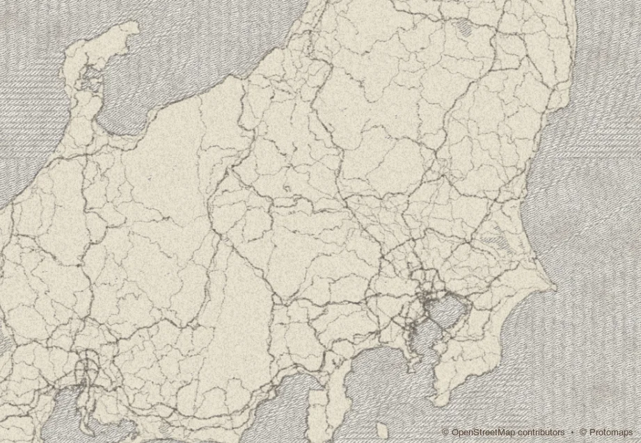

# ezu

[](https://crates.io/crates/ezu)
[](https://docs.rs/ezu)
[](https://github.com/reearth/ezu/actions/workflows/ci.yml)
[](#license)

**Painterly cartography** — render vector tiles as paintings — on a
**pure-Rust, GPU-free CPU renderer** with **first-class MapLibre
compatibility**.



`ezu` (絵図) is a Rust map rendering engine that turns vector tiles (MVT /
PMTiles) into raster tiles on the CPU — no GPU, no headless browser. It
does this two ways, and does both at once:

- **Painterly** — a declarative node-graph style language, **Ezu Style**,
  drives the [`hokusai`](https://github.com/reearth/hokusai) brush engine
  and a library of image-processing ops (blur, blend, warp, dither,
  gradients, …) to render watercolor, ink wash, ukiyo-e, and beyond, while
  preserving the geographic data underneath.
- **MapLibre-compatible** — `ezu translate` converts a MapLibre GL style
  into an ezu recipe, nodes carry raw MapLibre `*-expr` expression fields
  for data-driven styling, and the expression engine is the sister crate
  [`maplibre-expr`](https://github.com/reearth/maplibre-expr-rs) (100 %
  conformance against MapLibre's official spec fixtures). A Protomaps
  basemap MapLibre style renders end to end, labels included.

## Workspace

Each crate has its own README with API details and examples.

| Crate | crates.io | Description |
|---|---|---|
| [`ezu`](https://github.com/reearth/ezu/tree/main/crates/ezu) | [](https://crates.io/crates/ezu) | Umbrella crate, re-exports + feature flags |
| [`ezu-core`](https://github.com/reearth/ezu/tree/main/crates/ezu-core) | [](https://crates.io/crates/ezu-core) | Tile / world coordinates, deterministic seeding |
| [`ezu-features`](https://github.com/reearth/ezu/tree/main/crates/ezu-features) | [](https://crates.io/crates/ezu-features) | GIS feature parsing (MVT via `geozero`, GeoJSON) — no remote fetch |
| [`ezu-style`](https://github.com/reearth/ezu/tree/main/crates/ezu-style) | [](https://crates.io/crates/ezu-style) | Style spec parser (`serde`) — pure data, no rendering |
| [`ezu-graph`](https://github.com/reearth/ezu/tree/main/crates/ezu-graph) | [](https://crates.io/crates/ezu-graph) | Typed node-DAG evaluator (Cache, Rayon parallel) |
| [`ezu-paint`](https://github.com/reearth/ezu/tree/main/crates/ezu-paint) | [](https://crates.io/crates/ezu-paint) | Painting primitives, built-in nodes, host glue (PNG / asset banks / fonts) |
| [`ezu-translate`](https://github.com/reearth/ezu/tree/main/crates/ezu-translate) | [](https://crates.io/crates/ezu-translate) | Translate map-engine styles into ezu recipes — MapLibre GL is the first frontend |
| [`ezu-cli`](https://github.com/reearth/ezu/tree/main/crates/ezu-cli) | [](https://crates.io/crates/ezu-cli) | Command-line tool — `tile` / `bbox` / `tiles` rendering, `translate`, `check` validator, `graph`, `serve` live editor + tile server |
| [`ezu-wasm`](https://github.com/reearth/ezu/tree/main/crates/ezu-wasm) | — (`publish = false`) | WebAssembly bindings — scalar / SIMD / threads builds for in-browser rendering |

The expression engine lives in its own repository,
[`reearth/maplibre-expr-rs`](https://github.com/reearth/maplibre-expr-rs)
(published as [`maplibre-expr`](https://crates.io/crates/maplibre-expr)). A
`publish = false` internal benchmark, `ezu-compare`, converts a MapLibre
style, renders it with ezu, and pixel-compares against a maplibre-gl-js
reference.

## Try it

Install the CLI from crates.io:

```sh
cargo install ezu-cli
```

That puts an `ezu` binary on your `PATH`. Point it at any style (URL or
local path) and it renders PNGs. A style declares its own tile sources in
a `sources` block (MVT, PMTiles, raster DEM, RGBA raster, GeoJSON), so
most commands need nothing but a `--style` and a tile address; CLI flags
override anything declared there for one-off swaps.

The painterly reference styles reference their brushes by relative `file:`
path, so render them from a checkout (the brush files live next to the
style JSON in
[`crates/ezu/examples/styles/brushes/`](https://github.com/reearth/ezu/tree/main/crates/ezu/examples/styles/brushes/)):

```sh
git clone https://github.com/reearth/ezu && cd ezu

# Single tile to PNG (use `--out tile.webp` for lossless WebP). The
# reference styles bundle their own `sources` block (Protomaps daily
# build + Re:Earth Terrain), so no `--pmtiles` / `--mvt` is needed.
ezu tile --style crates/ezu/examples/styles/watercolor.json \
  --tile 13/7276/3225 --out tile.png
```

Styles whose assets are all remote or inline need no checkout — pass a
URL directly:

```sh
# Terrain style — pulls raster DEM tiles from terrain.reearth.land; no
# brushes, so it renders straight from a raw URL.
ezu tile \
  --style https://raw.githubusercontent.com/reearth/ezu/main/crates/ezu/examples/styles/hillshade.json \
  --tile 11/1813/807 --out fuji.png

# bbox mosaic — stitch the tiles covering a lon/lat box into one PNG.
ezu bbox --style URL_OR_PATH \
  --bbox 139.74,35.65,139.78,35.69 --zoom 13 --out tokyo.png

# XYZ pyramid — bulk-render `<out>/<z>/<x>/<y>.png` for a zoom range,
# parallel across cores.
ezu tiles --style URL_OR_PATH \
  --bbox 139.74,35.65,139.78,35.69 \
  --min-zoom 10 --max-zoom 14 --out pyramid

# Validate a style document (parse + build graph + resolve assets).
# Exits non-zero on error — drop into a pre-commit hook / CI step.
ezu check style.json
ezu check style.json --no-fetch    # parse + graph only, offline

# Translate a MapLibre GL style into an ezu recipe (via ezu-translate).
# The recipe is zoom-independent: zoom/data functions are emitted as raw
# expressions and evaluated per tile, so one recipe renders at every zoom.
# Skipped/approximated layers are reported on stderr. Writes to stdout
# without `--out`.
ezu translate maplibre-style.json --out recipe.json
ezu translate https://example.com/style.json | ezu check /dev/stdin --no-fetch

# `--verbose` (or `-v`) enables per-node debug logs from the
# evaluator: op name, cache hit/miss, output shape, eval duration.
ezu --verbose tile --style style.json --tile 13/7276/3225 --out tile.png
```

For deeper hacking, try the `tokyo` example, which renders a 2×2 batch
under the reference watercolor style with Rayon parallelism turned on:

```sh
cargo run --release --features parallel -p ezu --example tokyo
# Output PNGs in ./out/tokyo/
```

The live editor (browser-based, edit JSON → see the map update,
schema-validated as you type):

```sh
ezu serve                          # default example style
ezu serve crates/ezu/examples/styles/pencil-sketch.json  # open a specific style
ezu serve https://example.com/style.json          # or fetch one over http(s)
# Open http://127.0.0.1:8080
```

The editor (MapLibre GL based) supports:

- **Open / URL / Save** — load a style from a local file or http(s) URL,
  save the current buffer as `<name>.json`. Open on Chromium browsers
  uses the File System Access API so Save writes back in place.
- **Apply** with `⌘↵` / `Ctrl+↵` (works anywhere on the page).
- **Live preview** — when enabled, auto-applies on every keystroke that
  parses + schema-validates + server-validates clean.
- **External-edit reload** — when launched with a local path
  (`ezu serve foo.json`), the server polls the file and pushes
  Server-Sent Events on every change. The editor swaps the buffer
  silently when clean, or surfaces a Reload banner when the user has
  unsaved edits. The `↻ HH:MM:SS` indicator in the toolbar shows the
  last auto-reload. On Chromium, the same watch also runs against
  files opened via the in-browser file picker. Opening a different
  file via `Open…` / `URL…` detaches the server watch for that
  session.
- **Params panel** — controls generated from the style's `params`
  declarations (sliders for bounded numbers, color pickers, toggles).
  Adjustments ride the tile requests as query-string overrides and
  re-render live without touching the style text; `reset` returns to
  the declared defaults.
- **Source MVT inspector** — toggle a vector overlay of the underlying
  MVT, with per-layer ON/OFF and click-to-inspect feature properties.
  Layers are discovered from the tile at the map center; pan/zoom
  rescans automatically.
- **Tile grid + zoom indicator** — toggle a `z/x/y` boundary overlay
  (drawn per tile via `maplibregl.addProtocol`), and read the live
  zoom value (click to copy `z @ lat,lng`).

## MapLibre compatibility

ezu treats MapLibre GL as a first-class input, along three axes:

- **`ezu translate`** lowers a MapLibre GL style into an ezu recipe: the
  ordered layer list becomes a painter's-algorithm composite, and
  `background` / `fill` / `line` / `circle` / `symbol` / `raster` /
  `hillshade` / `heatmap` / `fill-extrusion` layers map onto ezu nodes.
  The recipe is **zoom-independent** — zoom and data functions (`stops`,
  `interpolate`, `step`, arbitrary expressions) are emitted as raw
  expressions and evaluated per tile, so one recipe renders correctly at
  every zoom. Unconvertible or approximated layers are reported as
  warnings. See the
  [`ezu-translate` README](https://github.com/reearth/ezu/tree/main/crates/ezu-translate)
  for the full mapping table.
- **Data-driven `*-expr` fields** — nodes accept raw MapLibre expressions
  wherever a value can vary per feature: `filter-expr` on `features`,
  `fill-expr` on `fill-solid`, `color-expr` / `width-expr` on `stroke`,
  `radius-expr` on `circles`, the `text` node's paint properties, and so
  on. You can hand-write these in an ezu recipe, not just inherit them
  from a translated style.
- **`maplibre-expr`** — the sister crate
  [`reearth/maplibre-expr-rs`](https://github.com/reearth/maplibre-expr-rs)
  is a pure-Rust parser/evaluator for the MapLibre expression language,
  at **100 % conformance** against MapLibre's official spec test fixtures
  (all operators — type checks, geometry, `collator`, legacy filters, …).
  Both `filter-expr` filtering and `*-expr` data-driven values run through
  it, so evaluation matches MapLibre exactly.

Text is MapLibre's `symbol` layer, ported: SDF glyphs, MapLibre glyph-PBF
endpoints, `format` / `text-variable-anchor` / line placement, icons
placed with their labels (`icon-text-fit` included), and collision that
is **deterministic across tile boundaries** and shared across every
label layer. See [Text labels](#text-labels).

## How it paints

A style is a **typed node DAG**, not an ordered layer list. Every
operation is a node; ports are statically type-checked across six
kinds — `Features` (geometry + props), `Raster` (canvas-sized RGBA),
`Sprite` (image at native dimensions, consumed by placement ops),
`Brush` (hokusai brush handle), `Scalar` (constants),
`ScalarField` (per-pixel `f32` grid — elevation, distance, scalar
noise; carries optional geographic scaling). Ports list the kinds
they accept, so polymorphic ops (e.g. `blur` over `Raster`/`Sprite`)
pass the input kind straight through. Intermediate buffers are
cached and reusable across tiles.

Tile-pyramid inputs go beyond vectors: `dem` sources feed elevation
as a `ScalarField`, and `raster` sources feed RGBA imagery (XYZ /
TileJSON / PMTiles; satellite photos, pre-rendered basemaps) as a
seam-free padded `Raster` — so any filter chain can post-process a
photo basemap (`photo-pop.json` posterizes 国土地理院 aerial
imagery). Styles and sources declare `attribution`, and sources
without one inherit upstream TileJSON / PMTiles metadata; the live
editor's MapLibre attribution control updates from
`GET /style/attribution` automatically.

External inputs — images, brushes, fonts, per-tile MVT/GeoJSON feature
layers — enter through one uniform `AssetLoader` trait. The style's
`features` node references its layer by `(source, layer)` pointing
into the document's `sources` block; the host binds decoded data
under `<source>.<layer>` per tile before rendering. Document-scoped
assets (brushes, images, fonts) name their bytes with a `scheme:`-prefixed
`src`/`url`:

- `file:PATH` — a disk path, resolved against `--assets-dir` (absolute
  paths honoured as-is).
- `http(s)://URL` — prefetched by native hosts (CLI, server, examples)
  via `ezu_paint::host::prefetch_doc_assets` at startup (behind the
  `http` feature).
- `data:` — a self-contained inline asset, decoded in-process (works in
  every host, including wasm).
- `builtin:NAME` — looked up in the host's in-memory asset bank, which
  the host populates at runtime (e.g. a wasm `bindSource`). **Nothing is
  bundled into the library**, so an unregistered name is an error.
- `system:FAMILY` — a font resolved by family name from the machine's
  installed fonts (see [Text labels](#text-labels)).

Source-format choice (MVT vs GeoJSON vs synthesized) is a host concern,
not a node concern.

The op set ships in [`ezu-paint`](https://github.com/reearth/ezu/tree/main/crates/ezu-paint):

- **Sources** — `solid` (full-canvas colour, or `kind: sprite` for a
  synthetic placement source), `circle` (centred disk, `kind: raster` or
  `sprite`), `noise` (white / value / perlin / simplex / worley fBm with
  octaves + domain warp, world-anchored for seamless borders; `kind:
  scalar` emits raw fBm as a `ScalarField`), `features` (host-bound
  feature layer by `(source, layer)`, with `filter-expr` and render-time
  `min-zoom` / `max-zoom` gates), `image` (load a PNG/WebP asset as a
  `Sprite`), `icon` (crop one named icon from a `sprite` atlas as a
  `Sprite`), `raster` (host-bound RGBA tile pyramid → padded `Raster`),
  `brush-file` (load a `.myb` brush), `brush-solid` (synthesize a crisp
  constant-width brush), `literal-geometry` / `tile-bounds` / `point-grid`
  (synthetic geometry sources)
- **Rasterization** — `fill-solid` (solid polygon fill + optional
  outline/blur), `fill-dabs` (hokusai scatter-dab fill, **world-
  deterministic** so dabs stay seamless across tile boundaries), `line`
  (hokusai brush stroke along polylines), `stroke` (crisp constant-width
  tiny-skia vector stroke with cap/join + optional `dasharray`, and a
  `gap-width` that renders MapLibre's `line-gap-width` casing annulus —
  clean cartographic lines), `line-stamp` (repeat a sprite along a polyline,
  tangent-rotated — MapLibre `line-pattern`), `circles` (crisp filled
  disks at feature points with per-feature radius/colour/stroke — the
  vector counterpart to MapLibre's `circle`), `stamp` (paint a sprite at
  every feature point, world-deterministic jitter), `place` (composite one
  image at fixed canvas coordinates with `fit: none/cover/contain/
  stretch`), `tiling` (repeat an image across the canvas, world-anchored),
  `text` (SDF glyph labels — see [Text labels](#text-labels)), and the
  shared-placement trio `text-labels` / `label-placement` / `text-draw`
  (every label layer's candidates collide in **one** index — see
  [Text labels](#text-labels))
- **Composition** — `blend` (W3C 16 blend modes — multiply / screen /
  overlay / soft-light / hue / luminosity etc., plus `composite`
  operators (`destination-out` for a brush-style eraser), `clip` for
  Photoshop-style clipping masks, and an optional alpha `mask` input),
  `stack` (composite an ordered `layers` list bottom-to-top with plain
  source-over — the n-ary form of a `blend` chain), `mix` (tween two
  rasters by a scalar `t` in a selectable colour `space` — a straight
  colour blend, not a composite), `blur` (libblur Gaussian; grows
  upstream pad by 3σ)
- **Warp** — `displace` (Photoshop-style displacement map: R/G channels
  of a second raster drive per-pixel offsets), `warp` (domain warp via
  built-in noise; world-anchored for seamless tile borders). Both grow
  upstream pad by `amp-px` and expose `clamp` / `transparent` /
  `mirror` boundary modes
- **Adjustment** — `brightness-contrast`, `levels` (Photoshop-style
  in/out black/white + gamma), `hsl` (hue rotation +
  saturation/lightness shift), `saturate` / `vibrance` (scale CIELAB
  chroma — uniform, or adaptively boosting low-chroma pixels — preserving
  hue + lightness), `invert`, `color-to-alpha` (chroma key)
- **Morphology / texture** — `erode` / `dilate` (per-channel min/max box
  filter, for mask cleanup), `edge-detect` (Sobel gradient magnitude),
  `sharpen` (4-neighbour Laplacian), `mosaic` (quantise into uniform
  square blocks — average / dominant / … — for pixel / mosaic looks)
- **Channel / palette** — `channel-shuffle` (rearrange RGBA, or stamp
  constants `0` / `1` into channels), `posterize` (per-channel
  quantisation), `quantize` (snap to a fixed palette by nearest colour in
  perceptual CIELAB or RGB — limited-palette / poster / pixel-art looks),
  `dither` (palette reduction with Floyd–Steinberg error diffusion or an
  ordered Bayer matrix — retro / print looks)
- **Geometry (fields → lines)** — `voronoi` (point set → diagram edges),
  `voronoi-fracture` (split polygons into Voronoi sub-cells via seed
  points), `medial-axis` (polygon → skeleton polylines for river / lake
  centrelines and similar), `triangulate` (Delaunay), `contour`
  (isolines from a `ScalarField` via marching squares)
- **Geometry (set + transform)** — `feature-boolean`
  (union / intersection / difference / xor over polygons),
  `transform` (translate / rotate / scale around a pivot), `bbox`
  (axis-aligned envelope), `buffer` (Minkowski offset by a disk; negative
  distance erodes polygons), `convex-hull`, `boundary` (polygon → boundary
  rings as polylines), `centroid` (one point per polygon / polyline),
  `smooth` (Chaikin), `simplify` (Douglas–Peucker), `densify`, `resample`,
  `hatch` (parallel-line polygon fill), `dash` (cut polylines into
  dash/gap segments), `wave` (lateral sine displacement of polylines)
- **Scalars & fields** — `zoom` (the tile's zoom level as a `Scalar`),
  `math` (arithmetic over literals / `$param`s / `@node` scalar ports),
  `expr` (evaluate a MapLibre expression once per tile → `Scalar`),
  `map-range` (linear remap of a `ScalarField` with optional clamp),
  `threshold` (binarise with optional soft ramp), `pick-channel` (extract
  R/G/B/A/luminance from a Raster as a `ScalarField`), `density`
  (kernel-density estimate of point features as a `ScalarField` — the
  MapLibre heatmap kernel), `switch` (build-time A/B selection over any
  port kind; great for param-driven variants)
- **Gradients** — `gradient-linear`, `gradient-radial` (elliptical via
  `aspect`), `gradient-conic`, `gradient-diamond`. All take color stops
  and an `anchor: "tile" | "world"` for tile-local or world-anchored
  (seamless across tiles) patterns. Stops interpolate in a selectable
  `space` (`rgb` default, plus `hsl` / `hsv` / `hcl` / `lab`; hue-based
  spaces take the shortest path around the wheel).
- **Terrain** — `dem` (sample a host-bound raster-DEM mosaic as a
  `ScalarField` with `geo_scale` populated; the host declares the tile
  pyramid in `sources` and handles fetch / decode / 3×3 stitch /
  overzoom upsampling for terrarium and mapbox-rgb encodings),
  `hillshade` (Horn-method analytical shade with `shade` or
  multiply-friendly `relief` mode — `relief` takes an optional
  `shadow-color` / `highlight-color` (à la MapLibre) — optional ESRI
  multidirectional), `slope`, `color-ramp` (any scalar field → colour via
  a stops table, with a selectable interpolation `space`; canonical use is
  hypsometric tinting of a DEM)

Example: a watercolor water layer with a brushed road on top of an
earth-tone background, composited bottom-to-top with `stack`.

```json
{
  "name": "demo",
  "tile-size": 512,
  "pad": 24,
  "sources": {
    "glazing":  { "type": "brush", "src": "file:brushes/watercolor_glazing.myb" },
    "basemap":  { "type": "mvt", "url": "https://papers.reearth.land/protomaps/tilejson.json" }
  },
  "nodes": {
    "bg":      { "op": "solid", "color": "#fbf6e6" },
    "earth":   { "op": "features", "layer": "earth" },
    "earth_p": { "op": "fill-solid", "features": "@earth", "fill": "#e8d9b0" },
    "water":   { "op": "features", "layer": "water" },
    "water_p": { "op": "fill-dabs", "features": "@water",
                 "color": "#5876a0", "opacity": 0.22,
                 "radius-px": 7, "spacing-px": 3 },
    "roads":   { "op": "features", "layer": "roads",
                 "filter-expr": ["==", ["get", "kind_detail"], "motorway"] },
    "brush":   { "op": "brush-file", "src": "@glazing" },
    "roads_p": { "op": "line", "features": "@roads", "brush": "@brush",
                 "color": "#4a3424", "radius-px": 2.6 },
    "out":     { "op": "stack", "layers": ["@bg", "@earth_p", "@water_p", "@roads_p"] }
  },
  "output": "@out"
}
```

`stack` composites its `layers` with plain source-over; reach for `blend`
when you want a specific blend mode, a composite operator, or a clipping
mask:

```json
"paper":  { "op": "solid", "color": "#fbf6e6" },
"shaded": { "op": "blend", "base": "@paper", "over": "@ink", "mode": "multiply" }
```

The full reference watercolor style is in
[`crates/ezu/examples/styles/watercolor.json`](https://github.com/reearth/ezu/tree/main/crates/ezu/examples/styles/watercolor.json).

All painting happens on a **padded canvas** (`tile_size + 2 * pad`) so
gaussian blurs and MVT buffer geometry that overflows `[0, extent]`
land inside the buffer; the output is cropped to the tile by
[`ezu-paint::host`](https://github.com/reearth/ezu/tree/main/crates/ezu-paint) before encoding.

## Text labels

The `text` node renders labels the way MapLibre's `symbol` layer does,
from vector features:

- **Shaping** — [`rustybuzz`](https://github.com/harfbuzz/rustybuzz)
  (a pure-Rust HarfBuzz port) shapes each label; `placement: point`
  labels each feature point, `placement: line` / `line-center` walks
  each polyline with tangent-rotated glyphs. Layout knobs mirror MapLibre
  — `justify`, `anchor` / `anchor-variants` (variable anchor), `offset-em`,
  `max-width-em` (wrapping), `letter-spacing-em`, `spacing-px`,
  `max-angle-deg`, `keep-upright`.
- **Two glyph backends** — the `font` fallback stack names `font` and/or
  `glyphs` sources:
  - a **`font` source** supplies outline font bytes (TTF / OTF / TTC),
    which ezu shapes and rasterises into an SDF itself. Its `url` is a
    font file (`file:`, `http(s)://`, `data:`) or an installed-font
    reference (`system:`, below).
  - a **`glyphs` source** is a MapLibre glyph-PBF endpoint — a
    `{fontstack}` / `{range}` URL template serving pre-rendered 24 px SDF
    glyphs in 256-codepoint ranges, fetched lazily per range. This is the
    exact glyph data maplibre-gl-js itself draws, so a translated style
    can label with zero font files.
- **SDF drawing** — glyphs are composited from signed-distance fields, so
  the `size`, `color`, and halo (`halo-color`, `halo-width`) are all
  cheap runtime parameters. Every paint property has an optional `*-expr`
  sibling (`color-expr`, `size-expr`, `halo-width-expr`, …) evaluated per
  feature.
- **Deterministic collision** — collision is on by default and is
  **deterministic across tile boundaries**: candidates come from this
  tile plus its 8 neighbours (host-bound under `<source>.<layer>@dx,dy`),
  deduped and placed greedily by `symbol-sort-key`, so a label straddling
  a tile edge is placed or dropped identically in both tiles. Set the
  node's `source` / `layer` (the upstream feature source) to enable
  neighbour gathering; without them collision is centre-tile-only.
  `allow-overlap` / `ignore-placement` / `padding-px` mirror MapLibre.
- **Shared cross-layer placement & icons** — label layers can split into
  `text-labels` (candidates) feeding one `label-placement` node, with a
  `text-draw` per layer painting its winners: every layer's labels then
  collide in **one** index, placed top layer first with ties broken by
  tile feature order, as MapLibre does. A point symbol's icon places
  *with* its text as one unit — `icon-size`/`-anchor`/`-offset`/
  `-padding`, overlap flags, `text-optional` / `icon-optional`, and
  `icon-text-fit` with nine-slice sprite stretching are all honoured.

### The `system:` font scheme

A `font` source can resolve a face from the **machine's installed
fonts** by family name instead of shipping bytes:

```jsonc
"sans": { "type": "font",
          "url": "system:Arial Unicode MS?weight=700&style=italic" }
```

The family may contain literal spaces or be percent-encoded; `weight`
(100–900, default 400) and `style` (`normal` / `italic` / `oblique`)
are optional query params. A `system:` reference makes the recipe
**machine-dependent** — the same family resolves to whatever face that
machine has installed, so glyph shapes and character coverage can differ
across environments, and it is **unavailable in the browser/wasm host**
(supply font bytes there). Reference a font file for a fully portable,
reproducible recipe.

```json
{
  "name": "labels",
  "tile-size": 512,
  "sources": {
    "basemap": { "type": "mvt", "url": "https://papers.reearth.land/protomaps/tilejson.json" },
    "sans":    { "type": "font", "url": "system:Helvetica" }
  },
  "nodes": {
    "bg":        { "op": "solid", "color": "#f7f4ee" },
    "places":    { "op": "features", "source": "basemap", "layer": "places" },
    "place_lbl": { "op": "text", "features": "@places",
                   "source": "basemap", "layer": "places",
                   "font": ["sans"],
                   "text": ["get", "name"],
                   "size": 14,
                   "color": "#333333",
                   "halo-color": "#ffffff", "halo-width": 1.2,
                   "color-expr": ["match", ["get", "kind"], "city", "#111111", "#555555"] },
    "out":       { "op": "stack", "layers": ["@bg", "@place_lbl"] }
  },
  "output": "@out"
}
```

## Performance

ezu renders on the CPU with a cache-aware, optionally Rayon-parallel
evaluator. On an **Apple M1** (4 performance + 4 efficiency cores), a
Protomaps basemap MapLibre style converted with `ezu translate` and
rendered at **512 px** evaluates in **~13–30 ms per tile single-threaded**
across z12–z15 — pure graph evaluation, MVT fetch/decode excluded:

```sh
cargo run --release -p ezu-compare -- \
  --style crates/ezu-compare/samples/protomaps-basemap.json \
  --tiles 12/3637/1613,13/7275/3225,14/14550/6452,15/29101/12904 \
  --bench --repeat 5
# eval: z12 ~22 ms, z13 ~30 ms, z14 ~19 ms, z15 ~13 ms
```

End to end, a 251-tile z13–z14 pyramid (`ezu tiles`, parallel evaluator
across all 8 cores) renders in **~9 s wall** — ~37 ms/tile amortized
*including* HTTP tile fetch, MVT decode, and PNG encode, which dominate
the per-tile wall at this render cost. Numbers are from this machine on
the sample style; your mileage varies with hardware, style complexity,
and network.

## WASM

[`ezu-wasm`](https://github.com/reearth/ezu/tree/main/crates/ezu-wasm)
compiles the renderer to WebAssembly for in-browser rendering. The JS
side owns all I/O and supplies decoded bytes — MVT/PMTiles tiles, brushes,
images, fonts, DEM/raster neighbours — to a stateful `Renderer` through
`bindSource`; `renderTile` returns PNG, lossless WebP, or raw RGBA (blit
straight to a `<canvas>` via `putImageData`).

Three builds sit side by side under `target/wasm/`:

- **scalar** and **SIMD** (`+simd128`) — both on stable Rust, run
  anywhere.
- **threads** — multithreaded rendering across Web Workers via
  [`wasm-bindgen-rayon`](https://github.com/RReverser/wasm-bindgen-rayon)
  and ezu's parallel evaluator. Off by default; needs a nightly toolchain
  to build and a **cross-origin-isolated** page (COOP/COEP headers) at
  runtime. `threadsEnabled()` / `self.crossOriginIsolated` let one
  codebase load whichever flavor the environment allows and fall back to
  single-threaded rendering otherwise.

A self-contained demo page and the server routes it needs (including the
COOP/COEP headers for the threads flavor) ship with `ezu serve`. See the
[`ezu-wasm` README](https://github.com/reearth/ezu/tree/main/crates/ezu-wasm)
for the full JS API, build commands, and benchmarks.

## Parametric styles

A style can declare typed parameters in a `params` block and reference
them anywhere a scalar field lives, with `$name`:

```jsonc
{
  "params": {
    "paper":    { "type": "color",  "default": "#fbf6e6" },
    "softness": { "type": "number", "default": 0, "min": 0, "max": 4,
                  "description": "Blur over the finished tile, in px." }
  },
  "nodes": {
    "bg":  { "op": "solid", "color": "$paper" },
    "out": { "op": "blur", "input": "@c4", "sigma": "$softness" }
  }
}
```

Parameters resolve at render time — the same built graph serves every
parameter combination, and the intermediate cache keys on the values a
node actually reads, so flipping one param only re-evaluates the nodes
that depend on it. Override them per render:

```sh
# CLI: repeatable --param flags, validated against the declarations.
ezu tile --style watercolor.json --tile 13/7276/3225   --param 'paper=#ffe0f0' --param softness=2 --out tile.png

# Tile server: query-string overrides on the tile endpoint.
curl 'http://127.0.0.1:8080/tiles/13/7276/3225.png?paper=%23ffe0f0&softness=2'

# JSON Schema for the current style's parameters (defaults, ranges,
# descriptions) — drive sliders / color pickers off this.
curl http://127.0.0.1:8080/style/params
```

For computed values, wire scalars through the graph: `math` does
arithmetic over numbers (literals, `$param`s, or `@node` scalar ports)
and `zoom` emits the tile's zoom level, so zoom-dependent styling is a
two-node chain:

```jsonc
"z":        { "op": "zoom" },
"zfrac":    { "op": "math", "fn": "div", "a": "@z", "b": 16 },
"lu_alpha": { "op": "math", "fn": "mul", "a": "$landuse-alpha", "b": "@zfrac" },
"landuse":  { "op": "fill-solid", "features": "@landuse_feat",
              "fill": "#a6c084", "fill-alpha": "@lu_alpha" }
```

For MapLibre-native curves, `expr` evaluates a full MapLibre expression
once per tile (with the tile's zoom in the context) and emits a `Scalar`
you can feed to any node's scalar field.

One constraint: fields that decide canvas padding at build time (blur
sigmas and friends) need a static upper bound — a literal, or a
`$param` with `max` declared. Wiring those from a `@node` port is a
build error.

See `crates/ezu/examples/styles/watercolor.json` for a complete
parametric style.

Styles can also factor repeated node patterns into **user-defined
functions** — reusable subgraphs with typed input ports, called with
`op: "func"` and expanded inline at build time. The full semantics
(argument substitution, hygiene, recursion errors) live in the
[`ezu-style` README](https://github.com/reearth/ezu/tree/main/crates/ezu-style#functions);
`pencil-sketch.json` shows them in action.

## Custom ops

`NodeFactory` is a public trait — any downstream crate can register
its own ops on top of `ezu-paint::nodes::default_registry()` and feed
the registry to `ezu-graph::build_graph`. The JSON Schema served at
`/schemas/ezu-style.json` by `ezu serve` is derived from the live
registry, so custom ops get editor autocomplete (and as-you-type
validation in the live editor) out of the box.

## Brushes

Nothing is bundled into the library — a style references every brush it
uses through a `src` in its `sources` block. The example styles ship
their brushes alongside the style JSON in
[`crates/ezu/examples/styles/brushes/`](https://github.com/reearth/ezu/tree/main/crates/ezu/examples/styles/brushes/)
and reference them by relative `file:` path (resolved against the style
file's directory); those are CC0 brushes by David Revoy from
[`mypaint/mypaint-brushes`](https://github.com/mypaint/mypaint-brushes)
(attribution in
[`brushes/CREDITS.md`](https://github.com/reearth/ezu/tree/main/crates/ezu/examples/styles/brushes/CREDITS.md)).
Any MyPaint `.myb` brush works — declare it in the style's `sources`
block and the host loads it from disk or HTTP.

## License

Licensed under either of [Apache License, Version 2.0](LICENSE-APACHE) or
[MIT license](LICENSE-MIT) at your option.
